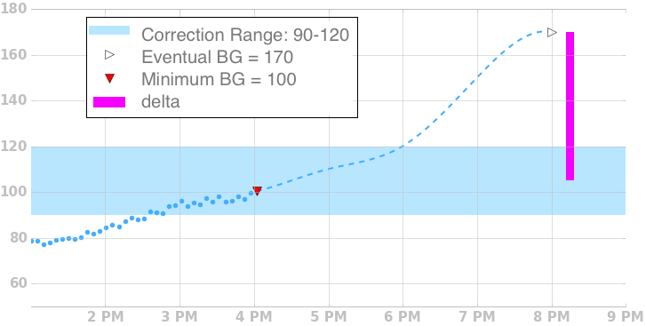
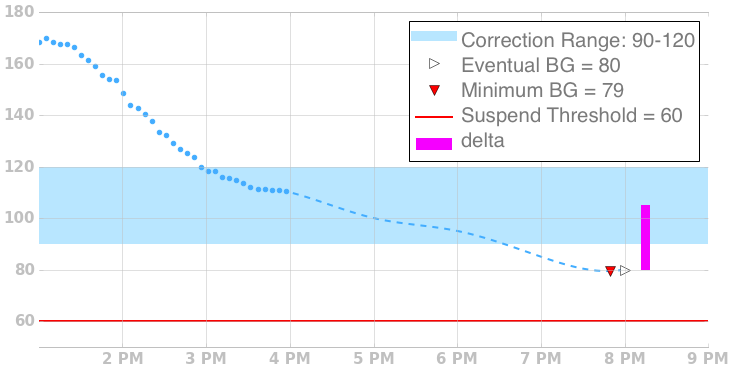
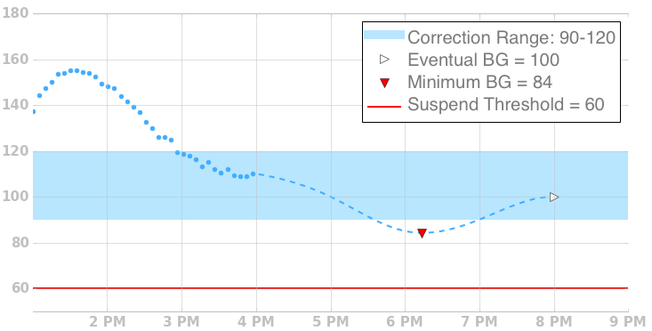
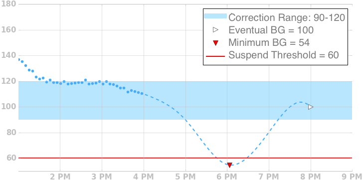
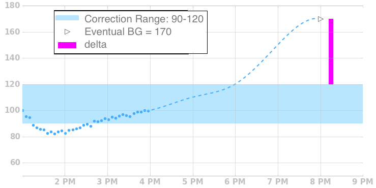

# Understanding the Algorithm

This is based on an article by Katie DiSimone - you can find the orginal [here](https://loopkit.github.io/loopdocs/operation/algorithm/overview/)

The reference documentation for the OpenAPS algorithm can be found [here](http://openaps.readthedocs.io/en/latest/docs/While%20You%20Wait%20For%20Gear/Understand-determine-basal.html)

## Overview

Loop’s algorithm for adjusting insulin delivery is oriented around making a glucose prediction. Every five minutes, triggered by new BG data, it generates a new prediction. Both bolus recommendations and temporary basal rates are set based on this prediction.

## Terminology
This graph and legend illustrates terms commonly used in discussing Loop's algorithm, and shows them in the context of historical and forecasted BG in a style similar to the status screen of Loop.

Fig. 1 Chart illustrating terms

#### Duration of Insulin Action (DIA)
A configuration value that provides an estimate of how long insulin stays active after delivery.
#### Correction Range
This is the low and high BG values that Loop will attempt to keep you between.
#### Predicted Glucose
Loop makes a prediction of glucose values out for a length of time equal to your Insulin Action Duration.
#### Eventual BG
The last value of the prediction.
#### Minimum BG
The lowest glucose value at any point in time within the prediction.
#### Suspend Threshold
A configuration value below which Loop will suspend all insulin delivery.
#### CGM Data
Actual glucose measurements made by a continuous glucose monitor.
#### Insulin Sensitivity (ISF)
A configuration value that provides an estimate of how much blood glucose will drop given a unit of insulin.

## Temp Basal Adjustments
If blood glucose is predicted to stray outside of the desired target range, Loop will adjust the basal rate temporarily in an attempt to keep actual blood glucose in range. To illustrate how it does this, we’ll go through a few examples.

### Eventual BG Above Correction Range

Eventual BG Above Range

When eventual BG is predicted to go above the current correction range, Loop will calculate a delta from eventual bg to the midpoint of the correction range. Using the currently scheduled insulin sensitivity factor, loop calculates a temporary basal rate above your currently scheduled basal rate that would deliver, over 30 minutes, enough insulin to bring glucose levels back into range, capped at the max basal rate.

### Eventual BG Below Correction Range

Eventual BG Below Range

When eventual BG is predicted to go below the current correction range, Loop will calculate a delta from eventual bg to the midpoint of the correction range. Using the currently scheduled insulin sensitivity factor, loop calculates a temporary basal rate below your currently scheduled basal rate that would reduce insulin delivery, over 30 minutes, enough to bring glucose levels back into range. It will reduce delivery to zero if needed.

### Temporary Excursion Below Range

Eventual BG Below Range

If the prediction has a temporary excursion below range, but Eventual BG is in range, Loop will revert to using your normal basal schedule, as long as Minimum BG is above the suspend threshold.

### Minimum BG Below Suspend Threshold

Min BG Below Guard

If Minimum BG drops below Suspend Threshold, Loop will zero temp your pump regardless of where Eventual BG is.

## Bolus Recommendations⌁
Loop also uses the forecast to generate recommendations for bolus amounts. Carbs are not directly used in bolus calculations, but rather indirectly through the forecast. After carbs are entered, the forecast is updated using the carb amounts, and then a recommendation is generated using the forecast.

The forecast used for bolusing is slightly different than the forecast used for adjust temp basals in that positive BG momentum is not included.

### Eventual BG Above Correction Range

Fig 2. Eventual BG Above Range

A bolus recommendation is given if Eventual BG is above Correction Range. The delta between Eventual BG and the top of the Correction Range is used, along with your current Insulin Sensitivity to calculate the recommendation.

## Glucose Prediction⌁
Loop makes a new glucose prediction every five minutes by computing the effects of insulin that has been administered from the pump, and carbohydrate records that have been entered into Loop. Two additional terms, glucose momentum, and optionally retrospective correction will also be used.

You can see the individual contributions of these effects by tapping on the predicted glucose graph on Loop's status screen.