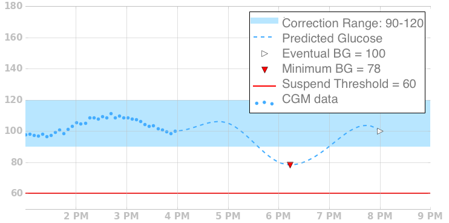

# Understanding the Algorithm

This is based on an article by Katie DiSimone - you can find the orginal [here](https://loopkit.github.io/loopdocs/operation/algorithm/overview/)

The reference documentation for the OpenAPS algorithm can be found [here](http://openaps.readthedocs.io/en/latest/docs/While%20You%20Wait%20For%20Gear/Understand-determine-basal.html)

## Overview

Loop’s algorithm for adjusting insulin delivery is oriented around making a glucose prediction. Every five minutes, triggered by new BG data, it generates a new prediction. Both bolus recommendations and temporary basal rates are set based on this prediction.

## Terminology
This graph and legend illustrates terms commonly used in discussing Loop's algorithm, and shows them in the context of historical and forecasted BG in a style similar to the status screen of Loop.

Chart illustrating terms

#### Duration of Insulin Action (DIA)
A configuration value that provides an estimate of how long insulin stays active after delivery.
#### Correction Range
This is the low and high BG values that Loop will attempt to keep you between.
#### Predicted Glucose
Loop makes a prediction of glucose values out for a length of time equal to your Insulin Action Duration.
#### Eventual BG
The last value of the prediction.
#### Minimum BG
The lowest glucose value at any point in time within the prediction.
#### Suspend Threshold
A configuration value below which Loop will suspend all insulin delivery.
#### CGM Data
Actual glucose measurements made by a continuous glucose monitor.
#### Insulin Sensitivity (ISF)
A configuration value that provides an estimate of how much blood glucose will drop given a unit of insulin.
